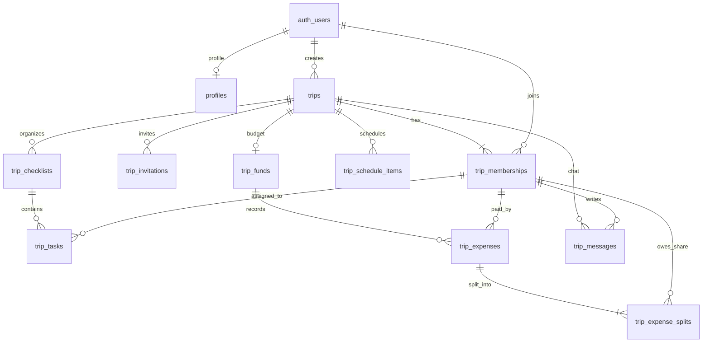

# Báo cáo thiết kế database cho hệ thống lập kế hoạch du lịch

> Ngày khảo sát: 2026-10-02  
> Trạng thái: đề xuất kiến trúc và schema; chưa tạo bảng, migration hay thay đổi luồng ứng dụng.

## 1. Tóm tắt đề xuất

Sử dụng **Supabase Postgres làm nguồn dữ liệu duy nhất**, **Supabase Auth làm danh tính**, và các bảng quan hệ để quản lý chuyến đi, thành viên, checklist, lịch trình cùng chi tiêu. Ảnh bìa lưu trong Supabase Storage; database chỉ lưu đường dẫn object. Trạng thái “sắp tới/đã qua” được tính từ ngày chuyến đi và múi giờ, không lưu như dữ liệu độc lập.

Project đã có Supabase Auth SSR nhưng hiện chưa cài Prisma, chưa có thư mục migration và chưa có bảng nghiệp vụ trong repo. Hướng đi ưu tiên cho sản phẩm này là Supabase Auth + Postgres, với Prisma server-only trong Next.js làm DAL duy nhất cho CRUD nghiệp vụ; browser không ghi trực tiếp vào các bảng app qua Data API.

Các migration SQL của Supabase là **nguồn sự thật cho schema, constraint, quyền và RLS**. Prisma Client chỉ dùng ở server; mọi thao tác xác thực thành viên và vai trò tại DAL/service vì Prisma dùng database credential, không kế thừa JWT của người đang đăng nhập.

Trong MVP, quỹ nhóm là sổ ghi nhận khoản chi và phần chia, không xử lý chuyển tiền. Số dư từng người được tính từ các khoản đã trả trừ phần được chia; không lưu một số dư tổng hợp có thể lệch khỏi sổ chi.

## 2. Khảo sát project và giao diện

### Nền tảng hiện có

- Next.js `16.3.7`, App Router, React `19.3.0`, TypeScript `6.0.3`; `cacheComponents: true` trong `next.config.ts`.
- `@supabase/ssr` và `@supabase/supabase-js` đã được cài. Server Auth hiện xác thực bằng `getClaims()` trong luồng bảo vệ route.
- Không thấy package `prisma`, thư mục `prisma/`, hay bảng nghiệp vụ trong repo. `supabase/seed.sql` hiện chỉ là placeholder.
- `supabase/config.toml` khai báo Postgres local major version 17, expose `public` và `graphql_public`, migration bật, `schema_paths = []`; chưa có `supabase/migrations/` hoặc `supabase/schemas/`.

### Những phần thấy trong `design/`

- `design/trips.html`: danh sách chuyến đi, tìm theo điểm đến, lọc Tất cả/Sắp tới/Đang lên kế hoạch/Đã qua.
- `design/trip-create.html` và `design/trip-detail.html`: tên, khu vực, mô tả, ảnh bìa, ngày đi/về, nhịp chuyến, lịch trình dạng lịch tuần, thành viên, quỹ nhóm, ghi chú và chat.
- `design/assets/trip-calendar.js`: hoạt động có ngày, giờ bắt đầu/kết thúc, loại Khám phá/Ẩm thực/Di chuyển/Lưu trú/Tự do và ghi chú. Lịch hiện cho phép các hoạt động trùng giờ.
- `design/assets/trip-store.js`: prototype lưu trong `localStorage` (`dream-day:v2`), lifecycle `draft/saved`, ảnh dạng data URL, khoản chi VND nguyên đồng và thành viên giả lập `self`.
- `design/assets/trips-data.js`: trạng thái mẫu `planning/upcoming/past` được viết sẵn theo ngày mẫu. Trạng thái này sẽ cũ theo thời gian nếu lưu nguyên như một enum nghiệp vụ.

**Checklist TODO chưa có trong các màn hình này**, nên mô hình checklist và deadline dưới đây là phần mở rộng theo yêu cầu mới. Thành viên trong prototype cũng chưa được mời qua email; khi chuyển sang hệ thống thật cần phân biệt lời mời đang chờ với thành viên đã xác thực.

### Chuyển từ model prototype sang dữ liệu chuẩn

| Prototype/localStorage                         | Database đề xuất                                                                    |
| ---------------------------------------------- | ----------------------------------------------------------------------------------- |
| `name`, `eyebrow`, `description`               | `trips.title`, `destination_label`, `description`                                   |
| `startDate`, `endDate`, `pace`                 | `trips.start_date`, `end_date`, `pace`                                              |
| `coverImage` data URL                          | Upload bucket riêng; `trips.cover_object_path` lưu path                             |
| `schedules[]`                                  | Nhiều dòng `trip_schedule_items`                                                    |
| `members[]`                                    | Tài khoản đã tham gia ở `trip_memberships`; email chờ xác nhận ở `trip_invitations` |
| `expenses[]` với `payerId` và `participantIds` | `trip_expenses` và các dòng `trip_expense_splits`                                   |
| `note`                                         | `trips.note` trong MVP                                                              |
| `messages[]`                                   | `trip_messages` khi triển khai chat thật                                            |
| `lifecycle: draft/saved`                       | `trips.status`; phân loại hiển thị được tính theo ngày và trạng thái                |

Không nhận nguyên object localStorage từ trình duyệt để ghi database. Nếu cần nhập dữ liệu prototype cũ, tạo một luồng import riêng: parse bằng schema, ánh xạ `local-*` sang UUID mới và ghi bằng transaction có idempotency key.

## 3. Giả định nghiệp vụ cho MVP

1. Một chuyến đi có một chủ sở hữu, có thể mời nhiều tài khoản tham gia.
2. Chỉ thành viên đã chấp nhận lời mời mới đọc dữ liệu chuyến đi; lời mời pending không có quyền đọc lịch, quỹ hay ghi chú.
3. Currency mặc định là VND. Mỗi quỹ dùng một currency; đổi currency không tự động đổi tiền cũ.
4. Lịch trình lưu mốc thời gian thực tế để sắp xếp “sắp diễn ra”; ngày đi/về của chuyến là ngày địa phương (`date`).
5. TODO có thể có người phụ trách và hạn hoàn thành; trạng thái hoàn tất lưu người và thời điểm.
6. Quỹ nhóm hiện là công cụ ghi nhận chi tiêu/chia phần, không kết nối ngân hàng, ví điện tử hay cổng thanh toán.
7. Chat và nhắc việc tự động là giai đoạn sau; có thể thêm bảng mà không nhồi các mảng JSON vào `trips`.

## 4. Sơ đồ quan hệ



`auth.users` là bảng Supabase quản lý. Không tạo bảng mật khẩu riêng và không sửa cấu trúc schema `auth`; dùng khóa chính `auth.users.id` để liên kết profile/thành viên.

## 5. Bảng và trường chính

Tên cột ở database dùng `snake_case`; Prisma model/field có thể dùng PascalCase/camelCase và ánh xạ về SQL. Các giới hạn dưới đây lấy theo giao diện prototype để tránh UI và backend nhận các giá trị khác nhau.

### `profiles`

| Cột                        | Kiểu          | Quy tắc                                       |
| -------------------------- | ------------- | --------------------------------------------- |
| `id`                       | `uuid`        | PK, FK `auth.users(id) ON DELETE CASCADE`     |
| `display_name`             | `varchar(40)` | Bắt buộc sau onboarding; trim và không rỗng   |
| `avatar_object_path`       | `text`        | Nullable; không lưu data URL                  |
| `locale`                   | `varchar(10)` | Nullable; mã locale của ứng dụng              |
| `created_at`, `updated_at` | `timestamptz` | `updated_at` do trigger hoặc service cập nhật |

Không hiển thị email của một người cho toàn bộ thành viên chỉ vì cùng đi một chuyến. Email chỉ xuất hiện ở màn mời và theo quyền phù hợp.

### `trips`

| Cột                                       | Kiểu            | Quy tắc                                                                         |
| ----------------------------------------- | --------------- | ------------------------------------------------------------------------------- |
| `id`                                      | `uuid`          | PK                                                                              |
| `created_by_user_id`                      | `uuid`          | FK `auth.users(id)`; audit người tạo, không thay membership owner               |
| `title`                                   | `varchar(40)`   | Bắt buộc khi chuyển khỏi draft; theo giới hạn prototype                         |
| `destination_label`                       | `varchar(40)`   | Nullable; khu vực/điểm nhấn hiện nhập dạng text                                 |
| `description`                             | `varchar(100)`  | Nullable                                                                        |
| `start_date`, `end_date`                  | `date`          | Có thể null trong draft; nếu có thì `end_date >= start_date`                    |
| `time_zone`                               | `text`          | IANA TZDB, mặc định `Asia/Ho_Chi_Minh`; dùng cho lịch và ngày chuyển trạng thái |
| `pace`                                    | enum/check      | `relaxed`, `balanced`, `active`; label dịch ở UI                                |
| `status`                                  | enum/check      | `draft`, `planning`, `confirmed`, `cancelled`, `archived`                       |
| `cover_object_path`                       | `text`          | Nullable; path trong bucket private                                             |
| `note`                                    | `varchar(1000)` | Ghi chú đơn cho chuyến đi theo UI hiện tại                                      |
| `version`                                 | `integer`       | Mặc định 1; hỗ trợ phát hiện ghi đè khi nhiều người cùng sửa                    |
| `created_at`, `updated_at`, `archived_at` | `timestamptz`   | Lưu UTC                                                                         |

Chủ chuyến là một dòng `trip_memberships.role = 'owner'`. Tạo trip và owner membership trong cùng transaction. Chỉ action chuyển quyền được phép thay owner.

### `trip_memberships`

| Cột                                     | Kiểu          | Quy tắc                                                                                          |
| --------------------------------------- | ------------- | ------------------------------------------------------------------------------------------------ |
| `id`                                    | `uuid`        | PK; thêm `UNIQUE (trip_id, id)` để FK con bảo đảm cùng trip                                      |
| `trip_id`                               | `uuid`        | FK `trips(id) ON DELETE CASCADE`                                                                 |
| `user_id`                               | `uuid`        | FK `auth.users(id) ON DELETE SET NULL`; null chỉ dùng cho bản ghi audit sau khi tài khoản bị xóa |
| `role`                                  | enum/check    | `owner`, `editor`, `member`, `viewer`                                                            |
| `status`                                | enum/check    | `active`, `removed`                                                                              |
| `joined_at`, `created_at`, `updated_at` | `timestamptz` | `joined_at` có giá trị sau accept invite                                                         |

Ràng buộc: không có hai membership active cho cùng `(trip_id, user_id)`; mỗi trip chỉ có tối đa một owner; giao dịch tạo trip phải tạo owner. Owner/editor sửa thông tin và thành phần chuyến; member dùng tính năng cộng tác theo quyền; viewer chỉ đọc.

### `trip_invitations`

| Cột                                       | Kiểu          | Quy tắc                                                         |
| ----------------------------------------- | ------------- | --------------------------------------------------------------- |
| `id`                                      | `uuid`        | PK                                                              |
| `trip_id`                                 | `uuid`        | FK chuyến đi                                                    |
| `email_normalized`                        | `text`        | Trim + lowercase; unique trong tập lời mời pending của một trip |
| `role`                                    | enum/check    | Không được mời vai trò `owner`                                  |
| `token_hash`                              | `text`        | Unique; không lưu token dùng trong URL ở dạng rõ                |
| `expires_at`, `accepted_at`, `revoked_at` | `timestamptz` | Lời mời một lần, có thời hạn                                    |
| `created_by_membership_id`                | `uuid`        | FK membership cùng trip                                         |
| `accepted_user_id`                        | `uuid`        | Nullable FK `auth.users(id)`                                    |

Khi accept: server kiểm tra token hash, hạn dùng và email Auth đã xác nhận khớp địa chỉ được mời; trong một transaction đánh dấu invite và tạo/khôi phục membership. Trước accept không tạo membership active.

### `trip_checklists` và `trip_tasks`

`trip_checklists` cho phép nhiều danh sách, ví dụ “Chuẩn bị trước chuyến đi” và “Đồ cần mang”. Khi tạo trip, tạo một checklist mặc định cùng transaction.

| Bảng              | Trường chính                                                                                                                                                                                                                                                         | Ghi chú                                                                                  |
| ----------------- | -------------------------------------------------------------------------------------------------------------------------------------------------------------------------------------------------------------------------------------------------------------------- | ---------------------------------------------------------------------------------------- |
| `trip_checklists` | `id`, `trip_id`, `title varchar(80)`, `sort_order`, `created_by_membership_id`, `created_at`, `updated_at`                                                                                                                                                           | FK `trip_id`; unique `(trip_id, id)`                                                     |
| `trip_tasks`      | `id`, `trip_id`, `checklist_id`, `title varchar(160)`, `description varchar(1000)`, `status`, `due_at timestamptz NULL`, `assignee_membership_id NULL`, `created_by_membership_id`, `completed_by_membership_id NULL`, `completed_at NULL`, `sort_order`, timestamps | Assignee/completer/creator phải thuộc cùng trip; `status` là `open`, `done`, `cancelled` |

TODO được hoàn tất bằng update có điều kiện theo `trip_id`, `membership`, trạng thái hiện tại và phiên bản; không nhận `completed_by_user_id` từ client. Hạn ngày/giờ nên chuyển theo múi giờ trip trước khi lưu.

### `trip_schedule_items`

| Cột                        | Kiểu           | Quy tắc                                                        |
| -------------------------- | -------------- | -------------------------------------------------------------- |
| `id`, `trip_id`            | `uuid`         | PK và FK trip                                                  |
| `title`                    | `varchar(80)`  | Bắt buộc                                                       |
| `category`                 | enum/check     | `explore`, `meal`, `travel`, `stay`, `free`                    |
| `description`              | `varchar(500)` | Nullable                                                       |
| `starts_at`, `ends_at`     | `timestamptz`  | Bắt buộc; `ends_at > starts_at`                                |
| `time_zone`                | `text`         | Mặc định từ trip; IANA time zone dùng để render giờ địa phương |
| `place_name`, `address`    | `text`         | Nullable; tọa độ chỉ thêm nếu giao diện cần bản đồ             |
| `status`                   | enum/check     | `planned`, `booked`, `completed`, `cancelled`                  |
| `sort_order`               | `integer`      | Tie-breaker cho các lịch trùng giờ                             |
| `created_by_membership_id` | `uuid`         | FK membership cùng trip                                        |
| `created_at`, `updated_at` | `timestamptz`  | UTC                                                            |

Mốc giờ local từ form (ngày + giờ) được đổi sang UTC bằng `time_zone` của trip. Giờ kết thúc `24:00` của prototype được chuẩn hóa thành `00:00` ngày kế tiếp. Không chặn hai hoạt động trùng giờ vì lịch prototype cho phép hiển thị chồng lấn.

### `trip_funds`, `trip_expenses`, `trip_expense_splits`

| Bảng                  | Trường chính                                                                                                                                                                                    | Ghi chú                                                                                                                                 |
| --------------------- | ----------------------------------------------------------------------------------------------------------------------------------------------------------------------------------------------- | --------------------------------------------------------------------------------------------------------------------------------------- |
| `trip_funds`          | `id`, `trip_id UNIQUE`, `currency_code char(3)`, `budget_limit_minor bigint NULL`, timestamps                                                                                                   | Một quỹ / trip; currency mặc định `VND`. Số tiền ngân sách là tùy chọn.                                                                 |
| `trip_expenses`       | `id`, `trip_id`, `fund_id`, `title varchar(60)`, `amount_minor bigint`, `spent_at date`, `paid_by_membership_id`, `created_by_membership_id`, `category`, `note`, timestamps, `deleted_at NULL` | `amount_minor > 0`; VND có exponent 0 nên số lưu bằng đồng nguyên như UI prototype. Người trả và người ghi nhận là hai thông tin riêng. |
| `trip_expense_splits` | `trip_id`, `expense_id`, `membership_id`, `share_minor bigint`                                                                                                                                  | PK `(expense_id, membership_id)`; thành viên phải cùng trip; `share_minor >= 0`                                                         |

Sổ chi phản ánh UI hiện có: khoản, số tiền, ngày thanh toán, người trả, người tham gia chia đều; phần dư được phân bổ xác định để tổng phần chia bằng tổng chi. Nếu sau này hỗ trợ currency khác, amount vẫn lưu bằng integer minor units và currency exponent phải lấy từ cấu hình currency đã kiểm soát, không dùng `float`/`double`.

`SUM(trip_expenses.amount_minor)` là tổng đã chi. Với mỗi thành viên:

```text
số dư = tổng amount_minor đã trả - tổng share_minor được phân bổ
```

Danh sách chuyển khoản cân bằng được tính từ số dư dương/âm ở server. Không lưu `balance` hay `total_spent` trên trip vì các giá trị này suy ra được và dễ lệch khi sửa/xóa khoản chi. Tạo/sửa/xóa expense và các split phải là một transaction; nếu expose Data API direct-write thì gom vào RPC có kiểm tra quyền và tổng split.

Nếu “quỹ” sau này nghĩa là có tiền nạp vào một pot thật, thêm `trip_fund_contributions` (ai nộp, bao nhiêu, lúc nào, ai ghi nhận). Không xem expense ledger hiện tại là giao dịch thanh toán thật.

### Phần mở rộng theo giao diện

- `trip_messages`: `id`, `trip_id`, `author_membership_id`, `body varchar(1000)`, `created_at`, `edited_at`, `deleted_at`. Chỉ thành viên active đọc/ghi; đánh dấu xóa thay vì sửa lịch sử thành viên khác.
- Cover/avatar: bucket private; DB giữ object path. Upload dùng RLS theo membership và giới hạn kích thước/MIME ở server. Không nhét Base64 vào Postgres.
- Notification/reminder: thêm bảng `trip_reminders` khi có yêu cầu gửi thông báo thực sự; cột tối thiểu `trip_id`, `task_id` hoặc `schedule_item_id`, `recipient_user_id`, `remind_at`, `sent_at`, `status`. Widget sắp diễn ra không cần bảng này.

## 6. Trạng thái và truy vấn chính

### Phân loại chuyến đi trên UI

Không lưu `upcoming` và `past` như trạng thái vĩnh viễn. Quy tắc hiển thị đề xuất, dùng ngày hiện tại trong múi giờ của từng trip:

1. `cancelled` hiển thị ở bộ lọc riêng hoặc bị ẩn theo lựa chọn sản phẩm.
2. Nếu `end_date` nhỏ hơn ngày địa phương hiện tại thì hiển thị `past`.
3. `confirmed` chưa kết thúc hiển thị `upcoming`.
4. `draft` và `planning` hiển thị `planning`; draft chỉ cho người tạo/chủ chuyến thấy.
5. `archived` không hiện trong danh sách mặc định.

`duration` được tính từ `start_date` và `end_date`. Ví dụ tĩnh trong `trips-data.js` chỉ dùng cho mockup/seed, không dùng làm trạng thái runtime.

### Widget “sắp diễn ra”

- Lấy các `trip_schedule_items` ở trạng thái `planned/booked`, `starts_at >= now()`, thuộc các trip mà user hiện tại có membership active; sắp xếp tăng dần theo `starts_at`.
- Lấy tasks `open` có deadline trong khoảng yêu cầu, cùng điều kiện membership.
- Gộp hai tập thành DTO `UpcomingItem` ở server; không tạo bảng tổng hợp thứ ba. Trả tối thiểu `tripId`, `tripTitle`, loại item, title, start/due, timezone, và path để điều hướng.
- Nếu muốn lịch theo ngày trong trip, group timestamp theo `time_zone`; nếu chuyến qua nhiều múi giờ, có thể nâng thành timezone riêng từng schedule item.

### Index đề xuất ban đầu

| Index                                                                                         | Mục đích                                  |
| --------------------------------------------------------------------------------------------- | ----------------------------------------- |
| `trip_memberships (user_id, status, trip_id)`                                                 | Tìm danh sách trip của user và lọc active |
| `trip_memberships (trip_id, status, role)`                                                    | Kiểm tra quyền theo trip                  |
| Partial unique `(trip_id, user_id) WHERE status = 'active'`                                   | Không nhân đôi thành viên active          |
| `trip_invitations (token_hash)` unique                                                        | Tìm token accept                          |
| Partial unique `(trip_id, email_normalized) WHERE accepted_at IS NULL AND revoked_at IS NULL` | Không gửi lời mời pending trùng email     |
| `trip_schedule_items (trip_id, starts_at)` partial cho item chưa hủy/hoàn tất                 | Calendar và upcoming feed                 |
| `trip_tasks (trip_id, due_at)` partial cho `status = 'open'`                                  | Checklist và due-soon feed                |
| `trip_expenses (trip_id, spent_at DESC)`                                                      | Danh sách khoản chi theo ngày             |
| `trip_expense_splits (trip_id, membership_id)`                                                | Tính phần chia theo thành viên            |

Index phải tương ứng các điều kiện RLS và query thực tế; kiểm tra `EXPLAIN ANALYZE` sau khi có dữ liệu thay vì thêm index cho mọi cột. Tìm kiếm text nâng lên trigram/full-text khi đo được vấn đề hiệu năng.

## 7. Bảo mật, quyền và RLS

### Ma trận quyền

| Tài nguyên/thao tác                         | Owner | Editor | Member                                             | Viewer | Người ngoài trip            |
| ------------------------------------------- | ----- | ------ | -------------------------------------------------- | ------ | --------------------------- |
| Đọc trip, member list, lịch, checklist, quỹ | Có    | Có     | Có                                                 | Có     | Không                       |
| Sửa metadata/ngày/pace và mời người         | Có    | Có     | Không                                              | Không  | Không                       |
| Tạo/sửa lịch và checklist                   | Có    | Có     | Có thể cho phép thêm/hoàn tất TODO theo chính sách | Không  | Không                       |
| Ghi khoản chi                               | Có    | Có     | Có; lưu riêng người ghi nhận và người trả          | Không  | Không                       |
| Đổi role/xóa thành viên/chuyển owner        | Có    | Không  | Không                                              | Không  | Không                       |
| Đọc/sửa email lời mời                       | Có    | Có thể | Không                                              | Không  | Chỉ qua luồng accept hợp lệ |

Quyền tạo/sửa của member là lựa chọn sản phẩm; nên bắt đầu với member tạo expense và TODO, còn metadata/mời thành viên do owner/editor quản lý.

### RLS và quyền Data API

- Bật RLS trên mọi bảng app trong schema được expose. Cấp `GRANT` tối thiểu theo từng role; grant quyết định role có chạm được bảng hay không, RLS quyết định row nào được thấy/sửa. RLS không thay cho GRANT.
- Với hướng Prisma DAL được chọn ở report này, không cấp quyền CRUD cho `anon`/`authenticated` trên các bảng nghiệp vụ qua Data API. Cấp role runtime Prisma quyền tối thiểu ở Postgres; RLS là hàng rào cho mọi đường Data API sau này, còn DAL/service là authorization bắt buộc của request Prisma.
- Gắn policy với `TO authenticated`, xác định user qua `(select auth.uid())`; không dùng `user_metadata` làm nguồn quyền.
- Trip và dữ liệu con chỉ cho membership `active`. Từng thao tác `SELECT/INSERT/UPDATE/DELETE` có policy riêng. Với `UPDATE`, cần cả `USING` lẫn `WITH CHECK` để ngăn chuyển trip/đổi owner/đổi author sang giá trị ngoài quyền.
- Ràng buộc FK composite `(trip_id, membership_id)` cho assignee, người ghi expense, payer và người chia để chặn ID của thành viên trip khác ngay trong database.
- Tránh policy đệ quy khi `trips` tra `trip_memberships` và ngược lại. Nếu cần helper `private.is_active_trip_member(trip_id)`, hàm phải chỉ suy ra user từ `auth.uid()` (không nhận `user_id` tùy ý), nằm trong schema không expose, có `search_path` cố định, quyền execute bị thu hẹp và được test bằng user member/non-member.
- Kiểm tra hiện trạng grant/RLS của project trước migration; không giả định bảng mới tự an toàn. Supabase đã thông báo thay đổi mặc định exposure Data API cho bảng mới và áp dụng cho các project hiện có từ 2026-10-30. Migration nên ghi tường minh `GRANT/REVOKE` để không phụ thuộc default.
- Nếu có Data API direct access từ browser, Supabase client dùng publishable key + session user; RLS bắt buộc. Không đưa `service_role`, database URL hay Prisma credential vào client.
- Storage bucket cover nên private; policy trên `storage.objects` xác nhận `bucket_id` và membership của `trip_id` trong path. Lưu path vào `trips.cover_object_path` và cấp signed URL cho người có quyền.

### Prisma không tự áp RLS theo user đăng nhập

Prisma kết nối Postgres bằng database connection string, không tự mang JWT Supabase của user từ cookie vào mỗi query. Hướng dẫn Prisma hiện hành của Supabase minh họa một database user đặc biệt có `BYPASSRLS`; vì vậy, **truy vấn Prisma không được dựa vào RLS để quyết định user có quyền xem trip hay không**.

Nếu chọn Prisma:

1. Mọi method trong DAL nhận `userId` chỉ sau khi server xác minh bằng `getClaims()`; không nhận `userId`/role làm dữ liệu đáng tin từ form.
2. Query trip bằng điều kiện membership trong cùng truy vấn; update/delete dùng điều kiện `tripId + active membership + role`, không lấy row theo ID rồi update chỉ bằng ID.
3. Dùng transaction cho các thay đổi nhiều bảng; actor được lấy từ session và lưu vào `created_by_membership_id`.
4. Tách credential runtime khỏi quyền DDL/migration; runtime credential là server-only, log/rotate như secret.
5. Chọn một luồng CRUD chính cho mỗi bảng. Không để Prisma và browser Data API cùng ghi một bảng khi chưa có policy/transaction contract được kiểm thử.

Report chọn **Prisma DAL server-only làm đường CRUD duy nhất cho bảng nghiệp vụ** vì tạo trip, mời thành viên, ghi expense và splits đều cần nhiều thao tác nguyên tử. Không bật đường ghi Data API song song. Nếu sau này ưu tiên client gọi Supabase Data API/user JWT để Postgres RLS tự giới hạn từng request, hãy chuyển sang Supabase Data API làm CRUD duy nhất thay vì giữ hai đường ghi.

## 8. Tích hợp Next.js và Prisma

### Luồng đọc/ghi đề xuất

```text
Server Component / Client form
        │
        ├── đọc: Server Component gọi trip DAL → DTO tối thiểu
        │
        └── ghi: Server Action (Zod) → xác minh getClaims()
                                      → kiểm tra membership/role
                                      → service transaction
                                      → revalidatePath/updateTag
```

- Giữ component UI chỉ điều khiển trạng thái form/lịch; rule tạo trip, chia tiền và quyền nằm trong `src/features/trips/services/`.
- Tổ chức tính năng dự kiến: `src/features/trips/{actions,schemas,services,queries,types}`; Server Actions là cổng mutation, Zod schema xác nhận ID/chuỗi/ngày/số tiền.
- Server Action là endpoint có thể bị gọi trực tiếp, nên tự xác thực và phân quyền lại; việc ẩn nút trên UI hoặc bảo vệ layout không thay cho authorization.
- DAL `server-only` lấy user đã xác minh, trả DTO hẹp cho RSC/Client Components; không trả nguyên record Prisma có email, invite token hoặc dữ liệu nội bộ.
- Do `cacheComponents: true`, truy vấn có session/cookie chạy trong request-time boundary nhỏ nhất phù hợp và có Suspense fallback. Không đặt dữ liệu trip riêng tư trong shared cache không khóa theo danh tính; không cache token/email/invite.
- Sau mutation, revalidate route/tag liên quan (trip detail, list, upcoming). Dùng optimistic concurrency `version` để báo xung đột nếu hai thành viên ghi cùng lúc.

### Prisma và kết nối

- Prisma hiện chưa có trong `package.json`; đây là quyết định cần làm trước khi viết DAL. Pin phiên bản Prisma theo major mà project chọn vì config connection URL thay đổi giữa các major.
- Nếu triển khai Next serverless, chọn Supabase pooler phù hợp cho runtime; dùng direct/session connection cho lệnh migration/introspection cần session đầy đủ. Cấu hình pooler/driver cho Prisma theo hướng dẫn của phiên bản đã pin.
- Prisma model chỉ là representation cho query/type safety. Tên model/field map về bảng SQL; Postgres partial indexes, RLS, GRANT, function/trigger, composite constraints cần được giữ trong migration SQL khi schema Prisma không diễn tả hết.

## 9. Migration và thứ tự triển khai

Chọn **Supabase SQL migrations làm nguồn schema chuẩn** vì repo đã có Supabase CLI/config, còn Prisma chưa được cài; các policy, grants và helper function cần SQL rõ ràng. Prisma Client, nếu được thêm, là query layer chứ không phải nguồn migration thứ hai.

1. Trước khi viết migration đầu tiên, xác nhận project Supabase đang trống hay đã có schema remote; nếu remote có dữ liệu/bảng, tạo baseline từ hiện trạng để không vô tình dựng lại hoặc xóa dữ liệu.
2. Tạo migration cho enum/check, profile, trip, membership, invitations, FK/index, RLS/grants; replay local từ đầu để xác nhận thứ tự phụ thuộc.
3. Thêm service tạo trip atomically: trip + owner membership + checklist mặc định + fund mặc định.
4. Thêm update trip và upload cover; không lưu ảnh Base64.
5. Thêm lịch trình và TODO; validate item nằm trong thời gian chuyến đi, đồng thời xử lý việc đổi ngày chuyến khi có schedule như prototype.
6. Thêm quỹ, expense và splits; ghi và tính lại split trong một transaction.
7. Thêm lời mời, audit quyền và kiểm tra RLS/service authorization với owner, member, viewer và người ngoài.
8. Sau cùng mới thêm chat/Realtime hoặc notification. Với Realtime, Supabase hiện khuyến nghị Broadcast cho khả năng scale; Postgres Changes phù hợp khi cần bắt đầu đơn giản, nhưng phải có authorization riêng.

RLS test tối thiểu trước khi mở Data API: user A đọc/sửa trip A được phép; user B không phải member không đọc/ghi được; viewer không ghi; member không nâng quyền; invitation pending chưa truy cập dữ liệu; expense split không trỏ member trip khác; update/delete không vượt quyền. Re-run migration trên local sạch sau mỗi đổi schema.

## 10. Các quyết định sản phẩm cần xác nhận trước implementation

Đề xuất mặc định đã được dùng trong schema phía trên; thay đổi các câu trả lời này có thể làm đổi một vài bảng:

1. **Quỹ nhóm** chỉ là ledger chia khoản chi (đúng theo UI prototype) hay có theo dõi khoản góp vào quỹ? Mặc định report chọn ledger; khoản góp là bảng phase sau.
2. Thành viên `member` có quyền sửa TODO/lịch của thành viên khác không? Mặc định có thể tạo TODO và hoàn tất task được giao; owner/editor quản lý lịch và thành viên.
3. Mời người qua email có cần gửi mail ngay không? Prototype chỉ lưu email local và chưa gửi lời mời; report chọn invitation pending có token một lần, không active membership trước accept.
4. Có cần cập nhật chat/lịch gần realtime trong MVP không? Mặc định không; Server Actions + revalidation trước, Realtime sau.
5. Chuyến đi quốc tế có thể đổi timezone theo từng hoạt động hay dùng một timezone của trip? Mặc định một timezone mỗi trip; schedule item có thể override ở giai đoạn sau.

## 11. Nguồn tham khảo

### Project và prototype

- `design/trips.html`
- `design/trip-create.html`
- `design/trip-detail.html`
- `design/assets/trip-store.js`
- `design/assets/trip-calendar.js`
- `design/assets/trips-data.js`
- `src/lib/supabase/server.ts`, `src/features/auth/components/common/require-session.tsx`, `src/features/auth/actions/auth.ts`, `next.config.ts`, `supabase/config.toml`, `supabase/seed.sql`

### Tài liệu chính thức

- [Supabase Row Level Security](https://supabase.com/docs/guides/database/postgres/row-level-security)
- [Supabase Securing your API](https://supabase.com/docs/guides/api/securing-your-api)
- [Supabase User Management / `auth.users`](https://supabase.com/docs/guides/auth/managing-user-data)
- [Supabase Prisma guide](https://supabase.com/docs/guides/database/prisma)
- [Supabase Postgres connections and poolers](https://supabase.com/docs/guides/database/connecting-to-postgres)
- [Supabase CLI local development workflow](https://supabase.com/docs/guides/local-development/cli-workflows)
- [Supabase Data API exposure change, effective for existing projects from 2026-10-30](https://supabase.com/changelog/45329-breaking-change-tables-not-exposed-to-data-and-graphql-api-automatically)
- [Supabase Storage access control](https://supabase.com/docs/guides/storage/security/access-control)
- [Supabase Realtime: subscribing to database changes](https://supabase.com/docs/guides/realtime/subscribing-to-database-changes)
- [Next.js data security and server-side DAL](https://nextjs.org/docs/app/guides/data-security)
- [Next.js authentication with Cache Components](https://nextjs.org/docs/app/guides/authentication-with-cache-components)
- [Next.js Server Actions security](https://nextjs.org/docs/app/guides/server-actions)
- [Prisma relational data modeling](https://www.prisma.io/docs/orm/data-modeling/relational-databases)
