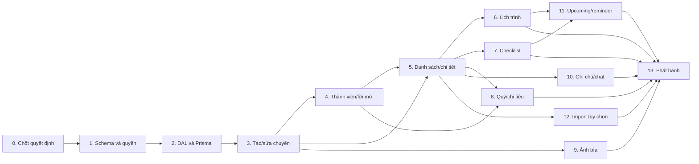

# Lộ trình triển khai hệ thống lập kế hoạch du lịch

Tài liệu này chia phần thiết kế tại [`../DATABASE_DESIGN_REPORT.md`](../DATABASE_DESIGN_REPORT.md) thành các gói công việc có thứ tự phụ thuộc. Mỗi gói có một file riêng để triển khai, review và nghiệm thu độc lập.

## Phạm vi

Sản phẩm cần hỗ trợ tạo chuyến đi, thành viên và lời mời, lịch trình, checklist TODO, sổ chi/quỹ nhóm, danh sách việc sắp diễn ra; giao diện tham chiếu nằm trong [`../design/`](../design/). Xác thực Supabase Auth đã có. Đây là kế hoạch triển khai, chưa tạo migration, bảng, action hay thay đổi giao diện.

## Thứ tự triển khai

| Thứ tự | File                                                                             | Phần việc                                                     | Kết quả chính                                                               |
| ------ | -------------------------------------------------------------------------------- | ------------------------------------------------------------- | --------------------------------------------------------------------------- |
| 0      | [00-product-decisions-and-baseline.md](00-product-decisions-and-baseline.md)     | Chốt phạm vi, kiểm tra baseline và quyết định cần khóa        | Các quyết định sản phẩm/kiến trúc được xác nhận trước khi schema đóng băng  |
| 1      | [01-database-schema-and-security.md](01-database-schema-and-security.md)         | Schema SQL, migration, khóa ngoại, index, grants và RLS       | Schema dựng lại được từ migrations và quyền được test                       |
| 2      | [02-nextjs-prisma-data-layer.md](02-nextjs-prisma-data-layer.md)                 | Prisma server-only, DAL/service/query, auth và cache boundary | Một đường đọc/ghi có kiểm soát từ Next.js xuống Postgres                    |
| 3      | [03-trip-creation-and-editing.md](03-trip-creation-and-editing.md)               | Tạo, sửa, lưu nháp và lưu chuyến                              | Trip mới có owner, checklist mặc định và fund mặc định nguyên tử            |
| 4      | [04-members-and-invitations.md](04-members-and-invitations.md)                   | Thành viên, role, lời mời, accept/revoke                      | Membership active chỉ được tạo sau accept hợp lệ                            |
| 5      | [05-trip-list-and-detail.md](05-trip-list-and-detail.md)                         | Danh sách, bộ lọc, chi tiết và điều hướng                     | Màn hình từ design có dữ liệu thật theo membership                          |
| 6      | [06-itinerary-and-scheduling.md](06-itinerary-and-scheduling.md)                 | Lịch ngày/tuần và schedule items                              | Hoạt động lưu UTC, hiển thị giờ địa phương, cho phép trùng giờ              |
| 7      | [07-checklists-and-todos.md](07-checklists-and-todos.md)                         | Checklist, TODO, phân công, deadline                          | TODO có trạng thái, thứ tự, người phụ trách và lịch sử hoàn thành tối thiểu |
| 8      | [08-group-fund-and-expenses.md](08-group-fund-and-expenses.md)                   | Ngân sách, khoản chi, split và số dư                          | Ledger VND nguyên đồng có tổng split khớp                                   |
| 9      | [09-private-cover-storage.md](09-private-cover-storage.md)                       | Ảnh bìa và quyền Storage                                      | Ảnh private; DB chỉ giữ object path                                         |
| 10     | [10-notes-chat-and-realtime.md](10-notes-chat-and-realtime.md)                   | Ghi chú, chat và tùy chọn realtime                            | Ghi chú MVP trước; chat/realtime theo phạm vi đã chốt                       |
| 11     | [11-upcoming-feed-and-reminders.md](11-upcoming-feed-and-reminders.md)           | Lịch/TODO sắp đến và reminder                                 | Upcoming là query tổng hợp; reminder là phần mở rộng riêng                  |
| 12     | [12-legacy-localstorage-import.md](12-legacy-localstorage-import.md)             | Nhập localStorage prototype (tùy chọn)                        | Import có preview, validation, idempotency, không ghi đè ngầm               |
| 13     | [13-release-readiness-and-operations.md](13-release-readiness-and-operations.md) | Tích hợp, hardening, vận hành và phát hành                    | Nghiệm thu bảo mật, dữ liệu, khôi phục và rollout                           |

## Đường găng và phụ thuộc

Các nhánh lịch, TODO, quỹ và ảnh có thể phát triển song song sau khi DAL và nền tảng trip/membership ổn định; khi tích hợp phải giữ migration theo thứ tự và replay trên database local sạch.

## Quyết định mặc định dùng chung

1. Supabase Auth là nguồn danh tính; Postgres là nguồn dữ liệu nghiệp vụ.
2. Supabase SQL migrations là nguồn sự thật của schema, constraint, quyền, RLS, trigger và function. Prisma chỉ là client/DAL runtime.
3. Chỉ Next.js server-side truy cập bảng nghiệp vụ bằng Prisma DAL. Không mở browser Data API ghi trực tiếp cùng bảng.
4. Mỗi Server Action xác thực session bằng flow `getClaims()` hiện có, validate input bằng Zod và kiểm tra membership/role trong service. ID/role từ client không phải bằng chứng quyền.
5. Dữ liệu trip không vào shared cache; với `cacheComponents: true`, truy vấn phụ thuộc cookie/session nằm dưới Suspense nhỏ nhất phù hợp.
6. Quỹ MVP là sổ chi và phần chia, không phải ví hay thanh toán. VND dùng số nguyên đồng; số dư tính từ ledger.
7. `upcoming`, `past`, `planning` là trạng thái hiển thị suy ra từ status/date/timezone, không lưu thành trạng thái độc lập.
8. Người được mời chưa có quyền trip cho tới khi xác minh danh tính và accept lời mời còn hạn.
9. User-facing copy mới qua `next-intl`; ngày/giờ/số tiền hiển thị theo locale và timezone.
10. Không chạy migration trên Supabase remote, nạp dữ liệu production hoặc gửi lời mời thật trong các bước local/CI.

## Definition of Done chung

Một phần hoàn tất khi migration replay được trên local sạch; query/action kiểm tra quyền server-side; input sai và quyền không đủ trả lỗi an toàn; loading/empty/error state được thiết kế; UI responsive và hỗ trợ keyboard/focus; bản dịch đủ locale đang hỗ trợ; test unit/integration/e2e tương ứng được thêm; typecheck/lint/build liên quan đạt; migration có phương án forward-fix; tài liệu được cập nhật nếu quyết định đổi.

## Quy ước triển khai

- Trước khi sửa source code, đọc hướng dẫn Next.js 16 đang cài trong `node_modules/next/dist/docs/` cho đúng tính năng, như AGENTS.md yêu cầu. Xem Server Actions, Cache Components authentication, data security và route conventions.
- Kiểm tra branch và `git status`; bảo toàn diff sẵn có. Không commit tài liệu nếu chưa được yêu cầu.
- Trước migration đầu tiên, xác nhận trạng thái remote Supabase và schema; chỉ thao tác trên local/dev được cấu hình rõ ràng.
- Không để `DATABASE_URL`, Prisma credential, service-role key hoặc token mời lọt vào client bundle, logs hay DTO.
- Ẩn nút UI và bật RLS không thay thế authorization trong Prisma DAL.

## Nguồn trong repo

- Thiết kế DB: [`../DATABASE_DESIGN_REPORT.md`](../DATABASE_DESIGN_REPORT.md)
- Danh sách chuyến: [`../design/trips.html`](../design/trips.html)
- Tạo chuyến: [`../design/trip-create.html`](../design/trip-create.html)
- Chi tiết chuyến: [`../design/trip-detail.html`](../design/trip-detail.html)
- Prototype store: [`../design/assets/trip-store.js`](../design/assets/trip-store.js)
- Calendar prototype: [`../design/assets/trip-calendar.js`](../design/assets/trip-calendar.js)
